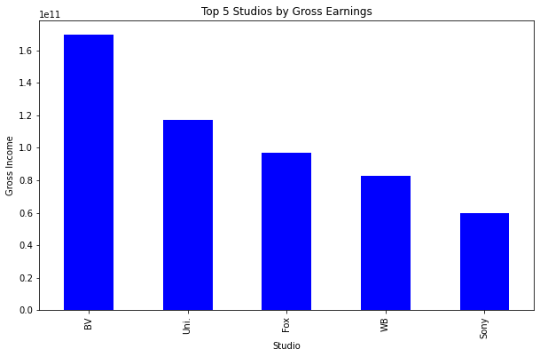

# MICROSOFT MOVIES - CAN IT HAPPEN?

`

## Overview

Microsoft wants to start creating original video content. 
This exploration incorporated various public movie datasets that contain information on films in the box office. 
They were then used to provide insight on the viability of the project for Microsoft, i.e. what the company should consider before embarking on the project. 
Some findings include the top grossing movies, movie genres and studios as well as genres that had the most movies.
Recommendations given include using more recent data (2018 to date) to provide updated information. and look into modern-day content such as social media content, live streaming to be able to compete with established studios. 

## Business Problem

What are the top grossing movies? The details will guide Microsoft on movie types to emulate.
What is the performance of movies by genre - number of movies, gross income, ratings? This will inform on the genres worth investing in.
How useful is the performance of a studio in terms of gross income? Microsoft may look into engaging the studios/directors for the content creation.

## Datasets Used

* [Box Office Mojo](https://www.boxofficemojo.com/) - bom.movie_gross.csv.gz
Determining the income returns per movie over the years.
* [The Numbers](https://www.the-numbers.com/) - tn.movie_budgets.csv.gz
Gauging the performance of films in the box office, hence, deciding on, for instance, the most popular genres.
* [IMDB](https://www.imdb.com/) - im.db.zip
The files of interest were imdb.title.basics.csv.gz (genre information and reviews) and imdb.title.ratings.csv.gz

## Data Preparation
* Files were imported using appropriate functions in Pandas.
* Some columns were dropped while others were added.
* The three datasets were then merged into one DataFrame (movies) for a cleaner analysis.
* Using pd_read to import data

## Data Analysis
Python libraries were used to conduct analysis.
Pandas
Numpy
Matplotlib
Sqlite3

## Evaluation/Findings
### 1. The top grossing movie is an Action, Adventure and Sci-fi movie.
* This is a pointer that movies in these genres are likely to do well in the industry.
"

### 2. The genres with the highest grossing are Adventure, Action and Comedy.

### 3. Most movies produced were in the Drama, Comedy and Action genres.
#### Possibilities
* The genres are cheaper and faster to produce.
* That there higher returns on investment from these genres
* There is more demand for these genres than most other genres.

### 4. Documentaries, Biography and War movies had the highest ratings on average. 
* It may mean one of two things - the fans are more responsive and/or the production quality standards are high.
"

### 5. Buena Vista, Universal Pictures and Fox Studios grossed the highest income of all the studios represented in the datasets.
"

## Conclusions
* The project is viable.
* Conduct further analysis using more recent data (2018 to date) to provide updated information.
* Look into modern-day content such as social media content, live streaming, 3-D and 4-D, etc. This will place them on a better playing ground with more established studios.

## Repository
* images
    * cinema-popcorn-ticket-movie-theatre-png-27.png
    * genre_rating.png
    * gross_genre.png
    * movies_genres_number.JPG
    * studio.png
    * top_grossing_movies.JPG
    
* zippedData
    * .gitattributes
    * .gitkeep
    * bom.movie_gross.csv.gz
    * rt.movie_info.tsv.gz
    * rt.reviews.tsv.gz
    * tmdb.movies.csv.gz
    * tn.movie_budgets.csv.gz
* .gitignore
* Jupyter_notebook.pdf.pdf
* Presentation.pdf
* README.md
* README.pdf
* student.ipynb
